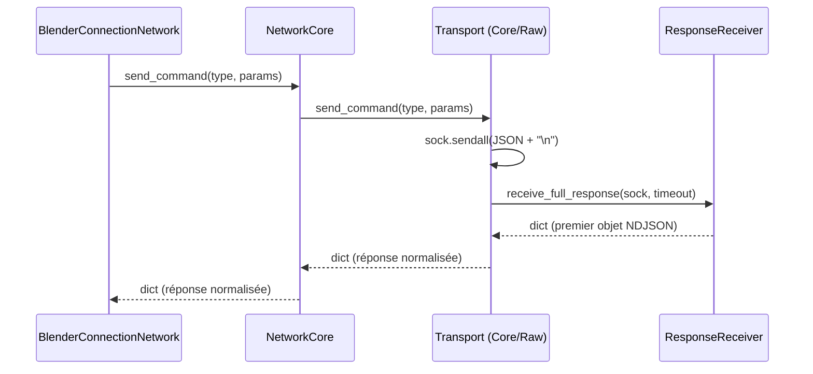

# Architecture canonique de blender-mcp

Ce document décrit l'architecture canonique actuelle du projet.
L'objectif est de séparer clairement le code qui dépend de Blender (API `bpy`) du code métier testable hors Blender, d'avoir des contrats de service stables et des conventions d'import claires afin de faciliter la maintenance et les migrations.

## Principes

- Service-facing vs Addon (Blender-side)
  - services/* : modules canoniques orientés service (API interne). Ils valident les paramètres d'entrée, délèguent aux implémentations Blender si nécessaire, et lèvent des exceptions en cas d'erreur (exceptions-first). Ils ne formatent pas la réponse finale JSON.
  - services/addon/* : implémentations Blender-only. Ces modules peuvent importer `bpy` (lazy import) et effectuer les opérations réelles dans Blender. Ils doivent rester simples et réutilisables.

- Lazy import de `bpy` : tout import de `bpy` doit être fait à l'intérieur de fonctions (lazy) afin que l'importation statique du package ne nécessite pas Blender. Cela permet d'exécuter les tests et d'analyser le code hors Blender.

- Façade de compatibilité : `blender_mcp/blender_ui/addon_handlers.py` continue d'exposer l'API publique côté add-on et délègue vers `services.addon` lorsque pertinent. Cela permet une migration progressive.

- TypedDicts et schéma de réponse : définir des types partagés (`services/types.py`) pour standardiser les réponses des services et améliorer le typage mypy.

## Packages / arborescence canonique proposée

- `src/blender_mcp/services/`
  - Modules service-facing (ex: `scene.py`, `object.py`, `screenshot.py`, `textures.py`, `polyhaven.py`, `execute.py`, `model.py`...)
  - Ils n'importent pas `bpy` au niveau module.

- `src/blender_mcp/services/addon/`
  - Implémentations Blender-side (ex: `scene.py`, `objects.py`, `screenshots.py`, `textures.py`, `polyhaven.py`, `execution.py`, `constants.py`).
  - Ces fonctions importent `bpy` à l'intérieur d'appels et renvoient des dicts riches ou `{"error": ...}` en cas de problème.

- `src/blender_mcp/servers/`
  - Code serveur / transport qui orchestre la réception des messages (sockets / ASGI wrappers / dispatch). Aucun `bpy` ici. Doit appeler les services canoniques.

- `src/blender_mcp/services/templates/`
  - Générateurs de templates, matériaux, spécifications de nœuds (`materials.py`, `node_helpers.py`). Ce code est purement logique et testable hors Blender.

- `src/blender_mcp/services/types.py`
  - TypedDicts et types partagés (GenericResponse, SceneResponse, ObjectResponse, MaterialSpec, etc.).

- `src/blender_mcp/addon_handlers.py`
  - Façade de compatibilité qui ré-exporte des helpers de `services.addon`.

## Materials (structure actuelle)

- Objectif: séparer clairement la génération « pure » d'un graphe de matériau (testable hors Blender) de la création effective dans Blender via `bpy`.

- Arborescence:
  - `src/blender_mcp/materials/`
    - `spec.py`: helpers purs
      - `build_material_spec(images_map, material_name=None)`: produit un dict JSON-serializable (`nodes`, `links`) pour un matériau Principled BSDF à partir des maps.
      - `_build_spec_from_keys(keys)`: utilitaire pour tests (déduit les slots à partir d'une liste de clés).
    - `blender_create.py`: intégration Blender optionnelle
      - `create_material_in_blender(images_map, material_name)`: tente de créer les nœuds dans Blender si `bpy` est disponible; retourne le nom ou `None` sinon.
    - `__init__.py`: ré-exporte les fonctions ci-dessus.
  - `src/blender_mcp/materials.py`: façade de compatibilité (ré-export) pour préserver les imports historiques.

- Règles:
  - Aucun import `bpy` au niveau module dans `materials/spec.py`.
  - Les tests unitaires ciblent `build_material_spec` et `_build_spec_from_keys` (purs). `create_material_in_blender` peut être validé via mocks si nécessaire.

## Contrats de service (exemples)

- Convention générale : les services lèvent des exceptions en cas d'erreur et retournent des données Python pures en succès. Le formatage `{status, result|message, error_code}` est effectué par les adapters (ASGI, dispatcher/command adapter, etc.).

Succès côté adapter (formaté):

```json
{"status": "success", "result": {...}}
```

Erreur côté adapter (formaté):

```json
{"status": "error", "message": "Blender (bpy) not available"}
```

- Les services définissent leurs types de données (e.g. `SceneInfo`, `ObjectInfo`) via `services/types.py` et ne doivent jamais retourner de dict d'erreur; en cas d'échec ils lèvent `InvalidParamsError`, `HandlerError`, `ExternalServiceError`, etc. Les adapters mappent ces exceptions vers `error_code`.

## Conventions d'import

- Les services doivent importer leurs implémentations addon via import relatif :

```py
from .addon import scene as addon_scene
```

- Le code qui ne dépend pas de Blender (tests, runners, CI) importe uniquement les modules `services.*`.
- Les adapters / couches transport importent les services et effectuent le mapping de réponse standard.

## Tests

- Ecrire des tests unitaires pour chaque service qui couvrent :
  - comportement quand `bpy` est absent (monkeypatch `sys.modules['bpy']`),
  - comportement quand `bpy` retourne un résultat valide (fake minimal),
  - validation des paramètres erronés.

- Ajouter des tests d'intégration simulés qui montent un dispatcher/connection factice et vérifient l'appel bout-à-bout.

## Migration & checklist

1. Ajouter `services/types.py` et `services/addon/` package.
2. Déplacer les implémentations Blender existantes sous `services/addon/`.
3. Pour chaque service, créer le wrapper service-facing qui appelle `services.addon`.
4. Enregistrer chaque service dans `services/registry.py`.
5. Mettre à jour la façade add-on (`blender_ui/addon_handlers.py`) si nécessaire.
6. Lancer ruff/mypy/pytest et corriger.
7. Mettre à jour documentation et créer PRs atomiques.

## Commandes utiles

```powershell
# tests
python -m pytest -q
# linter
ruff check src
# typage
mypy --show-error-codes src
# format
black --line-length 88 src
```

## Règles de sécurité

- Ne jamais exécuter du code arbitraire renvoyé par un tiers sans sandboxing.
- Préférer des appels paramétrés (create_model(params)) plutôt que l'exécution de scripts texte.

## Notes transport / embedded adapter

- Module adapter embarqué: `blender_mcp.servers.embedded_adapter` — expose `start_server_process`, `stop_server_process`, `is_running`.
- L'ASGI adapter (`asgi.py`) peut, selon la configuration, exposer la liste des tools/services. Pour inclure le registre des services dans `/tools`, définir `BLENDER_MCP_EXPOSE_REGISTRY_TOOLS=1`.

----

## Couche Transport (Phase A)

Objectif: séparer la sélection de transport et la réception/réassemblage du reste de la connexion (SRP) sans rupture publique.

- Protocole `Transport` (services.connection.transport):
  - Méthodes: `connect()`, `disconnect()`, `receive_full_response(buffer_size, timeout)`, `send_command(type, params)`.
  - Implémentations:
    - `RawSocketTransport`: socket TCP + protocole NDJSON (délimitation `\n`).
    - `CoreTransport`: proxy vers `connection_core.BlenderConnection` si disponible.
  - Sélection: `select_transport(host, port, socket_factory=None)`
    - Si `socket_factory` fourni → `RawSocketTransport` (tests/DI).
    - Sinon si Core dispo → `CoreTransport`.
    - Sinon → `RawSocketTransport`.

- Réception/réassemblage:
  - `ResponseReceiver` (services.connection.receiver) utilise `ChunkedJSONReassembler` (NDJSON) et gère les timeouts/paquets fragmentés.

- Orchestrateur réseau:
  - `NetworkCore` délègue désormais toutes les opérations au `Transport` sélectionné.
  - Compat préservée: API publique inchangée, normalisation `send_command` (retour `{status, ...}`) conservée.

- Exports publics (services.connection):
  - `Transport`, `RawSocketTransport`, `CoreTransport`, `select_transport`, `ResponseReceiver`.

- Tests ciblés:
  - `tests/test_transport_phase_a.py` couvre la sélection, les timeouts et le réassemblage.

Étapes suivantes possibles (non-breaking): injection optionnelle d'un `Transport` personnalisé dans la façade réseau si besoin, documentation complémentaire et métriques.

### Diagramme (vue d'ensemble)

